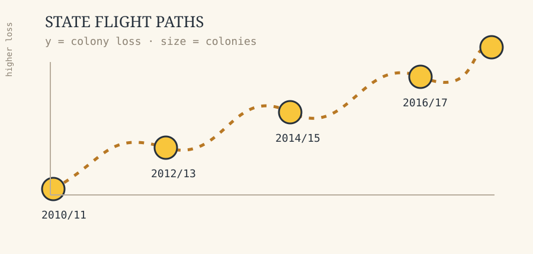
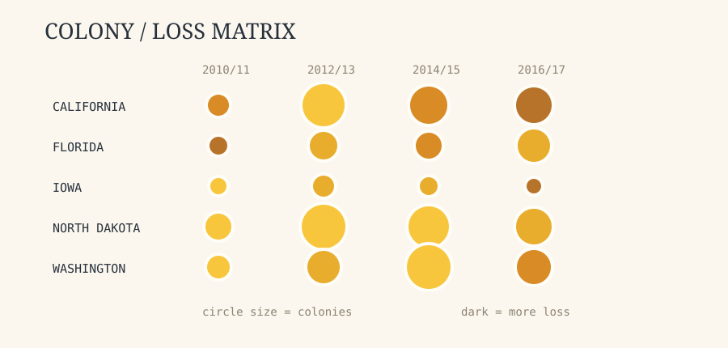
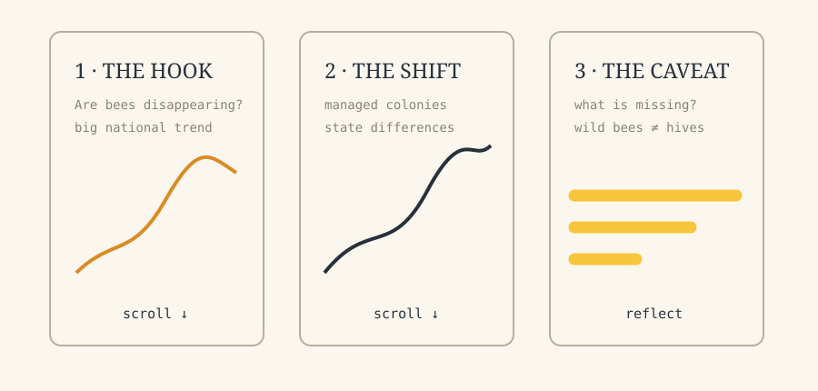

# Final Project Exploration 1

## Working theme: following the hive

I am interested in the relationship between pollinators, agriculture, and the places where people manage honey bee colonies. I want to start with honey bees because they connect a familiar everyday object (a jar of honey) to questions about climate, farming, land use, and the health of managed colonies. The idea is intentionally broad: I am not committing to a final dataset or format yet.

## Questions I might investigate

- Where are managed honey bee colonies concentrated, and how does that change over time?
- Do states with more colonies also report higher or lower annual loss rates?
- How different are the patterns for agricultural states, coastal states, and states with shorter growing seasons?
- Which stressors appear most often in the USDA colony-loss surveys?
- How could a visualization distinguish between a growing number of managed colonies and the health of individual colonies?
- What important parts of bee health are missing from a dataset based on managed hives?

## Potential datasets

- [USDA/NASS Bee and Honey surveys](https://www.nass.usda.gov/Surveys/Guide_to_NASS_Surveys/Bee_and_Honey/) — official annual and quarterly reports about colonies, losses, additions, renovations, and reported stressors by state.
- [USDA Honey Bee Colonies reports through ESMIS](https://esmis.nal.usda.gov/publication/honey-bee-colonies) — downloadable report files and historical releases.
- [Bee Colonies dataset used for Week 2](../public/data/bee-colony-loss/README.md) — the larger 1,222-row quarterly dataset with an Ohio record for every reported quarter.
- [TidyTuesday source CSV](https://raw.githubusercontent.com/rfordatascience/tidytuesday/main/data/2022/2022-01-11/colony.csv) — the full downloadable file used in the app.
- [FAOSTAT crops and livestock products](https://www.fao.org/faostat/en/#data/QCL) — a possible way to connect managed colonies and honey production to agricultural output.
- [GBIF occurrence data](https://www.gbif.org/occurrence/search?taxon_key=1341976) — a possible future source for mapping observations of *Apis mellifera*; this would need careful filtering and documentation because observation density is not the same as population size.

## Existing work and inspiration

- [Honey bee colony loss linked to parasites, pesticides and extreme weather](https://pmc.ncbi.nlm.nih.gov/articles/PMC9714769/) — research that combines colony-loss data with environmental factors and could inspire a layered comparison view.
- [Uptrend in global managed honey bee colonies and production](https://www.nature.com/articles/s41598-022-25290-3) — an example of using long-term time series to challenge a simple “bees are disappearing everywhere” story.
- [USDA Bee and Honey survey overview](https://www.nass.usda.gov/Surveys/Guide_to_NASS_Surveys/Bee_and_Honey/) — a useful reference for explaining how survey estimates are collected and what they do and do not represent.
- [The Pudding: Women in Parliament](https://pudding.cool/2020/03/women-in-parliament/) — inspiration for a scrollytelling structure in which a broad pattern becomes more specific as the reader scrolls.
- [Our World in Data](https://ourworldindata.org/) — inspiration for clear source notes, searchable charts, and letting a reader switch between a global overview and a selected place.

## Rough visualization sketches

These are quick rough concept sketches. They are deliberately rough: the goal is to try several structures before choosing one. The sketches are not meant to imply that the final project will use all three ideas. Before submitting, I need to replace these digital roughs with photographs or scans of my own hand-drawn paper sketches, as requested in the assignment.

### 1. A state-by-season “flight path”

Each state would become a line moving from season to season. The vertical position would show annual loss, while line color or a small bee icon could show the number of managed colonies. I like the connection to the Week 1 flight-path exercise, but I would need to watch out for too many overlapping lines.

### 2. A colony concentration / loss matrix

This idea uses a grid where rows are states and columns are seasons. Circle size would represent colony count and circle color would represent loss rate. It could help compare “large number of colonies” with “high loss,” but it may become visually dense and would need filtering or sorting.

### 3. A scrollytelling story about what “bee decline” means

The first screen would show a simple headline and an animated national trend. As the reader scrolls, the view would add managed colony counts, state-level differences, and possible stressors. The main challenge would be avoiding an overly dramatic narrative when the data only describes managed colonies and reported survey estimates.

## What I want to learn next

For the next exploration, I want to test whether the quarterly records for Ohio can be compared with nearby states and with the national aggregate without making the interpretation misleading. I also want to see whether the separate stressor table from the same TidyTuesday release can be joined to this colony table. A small-multiple chart, a map, and a scrollytelling layout are still all possible directions.
