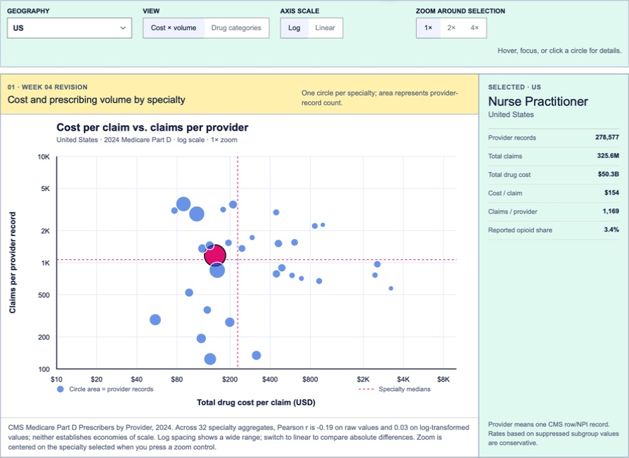
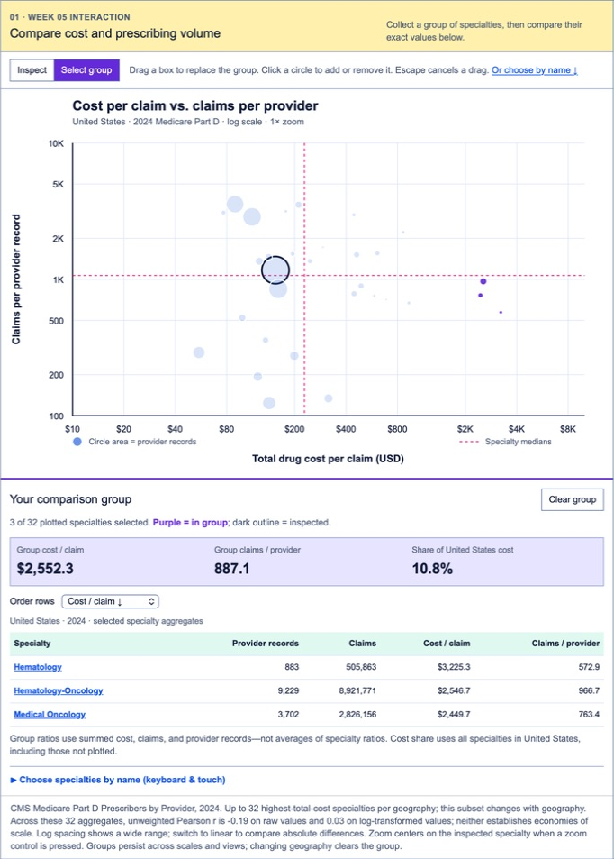
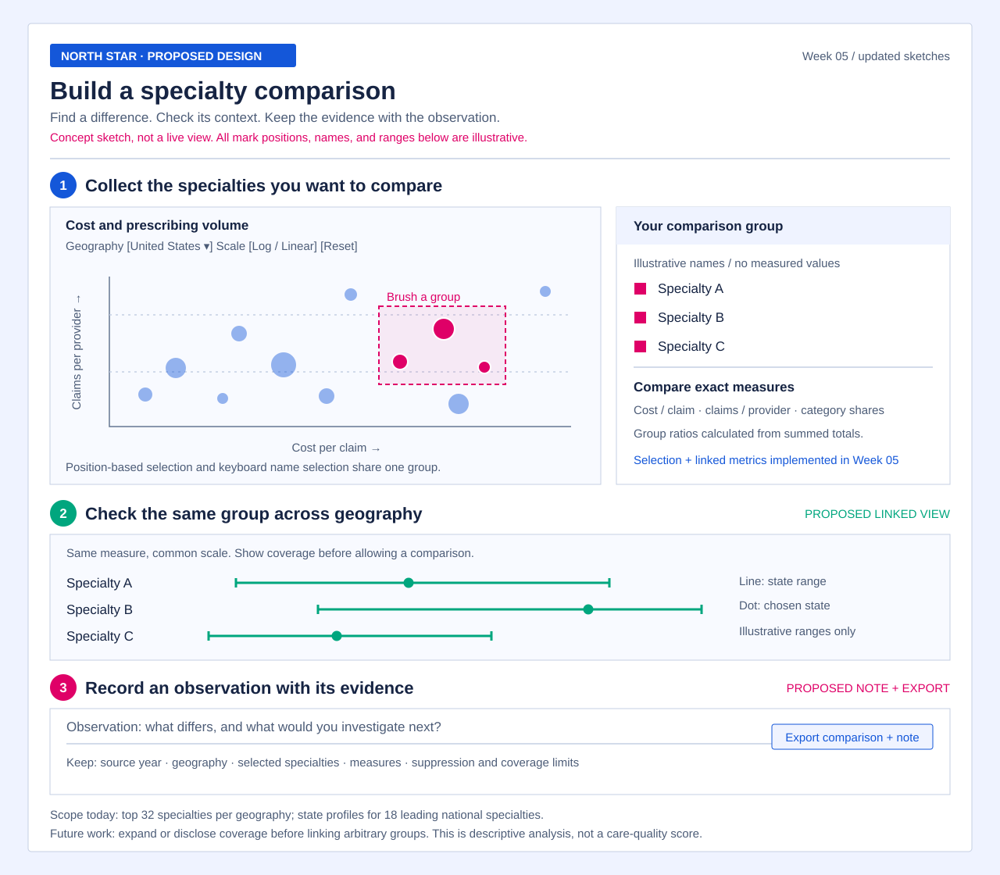

# Medicare Part D explorer: updated project proposal

Week 05 · Updated Sketches · September 2026

## Direction and audience

The project helps a healthcare analyst investigate how prescribing volume, drug cost, and reported drug-category shares differ across specialties and geography. Its central question is: **which specialty profiles stand apart, and does the comparison change when the reader changes geography or scale?** A hiring reviewer is a secondary audience for the analytical work.

The intended outcome is a small, defensible comparison that a reader can explain. A high cost per claim is a starting point for investigation; it is not evidence of poor care or inefficient prescribing.

## What changed since the earlier proposal

The earlier page offered many views but mostly supported inspecting one specialty at a time. Peer feedback exposed more immediate problems: crowded axes, uncertainty about logarithmic scales, and a label that obscured nearby marks. Week 04 addressed those issues with an in-chart title, better-spaced ticks, linear/log switching, selected-specialty zoom, and a label that disappears after hovering.

Week 05 makes comparison more deliberate. A reader can brush a rectangle around several specialties or select them by name using the keyboard. The selection drives a linked comparison with exact values and combined metrics calculated from the selected totals. For example, combined cost per claim is total selected cost divided by total selected claims, rather than an average of specialty averages.

The design lesson is to give each interaction a clear analytical purpose: inspect one item, collect a group, then compare that group. Changing a scale can reveal a different aspect of the distribution, but neither view establishes an explanation for the pattern.

## Assignment work informing the revision

### Week 04 — legibility

The legibility revision made the chart easier to read independently of the surrounding page. The original Week 03 source remains available for comparison.

### Week 05 — interaction

Brushing supports discovery by position; keyboard-accessible name selection supports finding a known specialty. Both update the same comparison, making the selection visible and reviewable. The screenshot joins two consecutive Safari scroll captures to show the chart and its linked table together; the data and interface are unchanged.

## Task Analysis

These tasks describe analytical goals independently of any visualization type.

1. Identify specialties with unusual combinations of cost per claim and claims per provider record.
2. Compare a chosen group of specialties with the retained comparison set on the same measures.
3. Determine how a specialty's profile varies across geographies where comparable data are available.
4. Compare reported opioid and antibiotic claim shares while accounting for missing subgroup values.
5. Identify the highest-total-cost provider records within a geography for limited supporting context.
6. Assess whether field completeness and data coverage support a proposed follow-up question.

## Data and interpretation

The 2024 CMS provider file has one record per NPI, with categorical specialty attributes, spatial identifiers, and quantitative claims, cost, beneficiary, and subgroup measures. Python preprocessing turns the large source file into compact browser data.

The current browser file retains **up to 32 specialties with the highest total drug cost in each geography**, state/territory profiles for the **18 highest-total-cost national specialties**, the ten highest-cost provider records per geography, whole-file distributions, and completeness metadata for all 84 fields. Specialty membership can change when geography changes. A brushed selection and the displayed correlation describe the retained specialties, not every specialty or individual provider.

Cost per claim is aggregate drug cost divided by claims; claims per provider record is claims divided by record count. Combined comparisons use summed numerators and denominators. The displayed specialty-level correlation is unweighted across specialties. Aggregation, the selected subset, and the reuse of claims in these ratios limit interpretation; these relationships do not establish economies of scale.

Reported opioid and antibiotic shares divide observed subgroup claims by all claims. Suppressed subgroup counts are not imputed, so these measures are lower bounds for the recorded population. Part D is only part of a provider's practice. Drug cost combines several payer sources and excludes manufacturer rebates. Provider beneficiary counts cannot be added into a count of unique people across providers.

The ten-record provider detail layer is limited context, not a complete specialty-to-provider drilldown. The project does not assign quality, efficiency, or provider-risk scores.

## New north-star sketch

**Proposed end-of-course design; not a screenshot of implemented features.** The new sketch connects three steps on the existing single page: build a specialty group, test the comparison across geography, and record an observation with its source and limits. It uses illustrative specialty names and mark positions, not analytical findings.

The ambitious addition is continuity between those steps. Selected specialties would remain recognizable throughout the comparison. Geographic ranges would help a reader check whether an apparent national difference persists across states. An evidence note would capture the geography, year, selected measures, and interpretation limits alongside the reader's observation.

### Built now

- A one-page D3/SVG explorer with geography and measure controls, exact-value inspection, and preserved weekly source files.
- Week 04 scale switching, zoom, chart-title and axis improvements, and hover-only labeling.
- Week 05 rectangular brushing, keyboard-accessible selection by name, and linked comparisons using selected totals.
- Python preprocessing and a static GitHub Pages deployment workflow.

### Proposed next

- Carry a selected group into coordinated geographic comparisons. The current state-profile subset must be expanded or its limits shown before supporting arbitrary specialties.
- Let readers save or export an observation with the comparison settings and CMS source. This evidence-note export is not implemented.
- Add a small number of carefully checked annotations. No trend or causal claim is implied by this sketch.
- Evaluate a state-boundary map against the current schematic tiles; use it only if boundaries improve the geographic task.
- Consider multi-year comparison after verifying consistent fields, definitions, and transformations across releases.

## Source organization

The original explorer and charts live in `src/assignments/week-01`; Week 02 holds data-preparation assignment source; Week 03 preserves the first-visual export; Week 04 contains the legibility copy; and Week 05 contains the interaction revision. This proposal and its screenshots/sketch live in `docs/`. The repository preserves Curran's starter history and deploys to the existing GitHub Pages site.

## Validation

The four levels below adapt Munzner's Chapter 4 framework to this project. They are a plan for evaluation, not claims about completed user studies.

1. **Domain situation.** Ask a healthcare analyst whether specialty and geography comparisons answer a useful research question. Check that the page does not suggest care-quality conclusions the data cannot support.
2. **Task and data abstraction.** Confirm that readers need to identify unusual groups, compare them, and inspect their coverage. Recalculate sample aggregates and selected-group ratios; check the top-32, top-18, and suppression limits against the intended tasks.
3. **Visual encoding and interaction idiom.** Observe a reader finding an unusual group, selecting two specialties, and explaining their difference without prompting. Check whether axes, size, log/linear controls, brush state, keyboard selection, and zoom communicate their meaning clearly.
4. **Algorithm.** Reconcile Python totals with the source and verify that selection produces the same combined values by independent calculation. Measure initial load and interaction responsiveness on a laptop and phone, including changing geography and clearing a selection.
