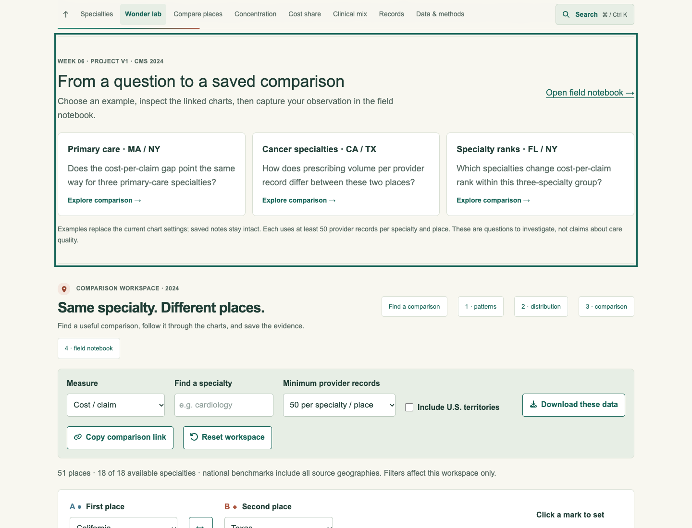
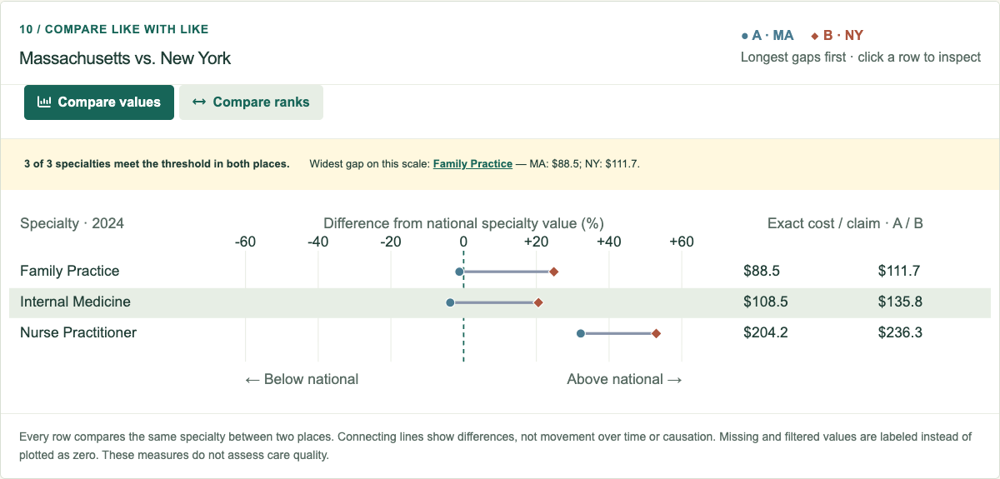

# Week 06 — Project V1

A refined version of the project proposal's core workflow: **select specialties → compare places → record evidence**.

[Hosted Week 6 entry](https://sd7777777.github.io/data-visualization-student-starter/#week-6) · [Project document](../../../docs/PROJECT_DIRECTION.md) · [Entry source](ProjectV1.tsx)

Week 6 Project V1 · September 29, 2026. Use the hosted link above to open the guided comparison workflow.

## What changed

Week 5 supported a selected group in a scatterplot. Project V1 connects that exploration to geographic comparisons and a field notebook. The new Week 6 entry adds three guided starting questions with complete, reproducible comparison settings. Each opens the paired chart and moves keyboard focus to it. Saved evidence remains intact when an example changes the workspace.

The first example compares cost per claim for Internal Medicine, Family Practice, and Nurse Practitioner records in Massachusetts and New York. The second compares claims per provider record for two cancer specialties in California and Texas. The third compares cost-per-claim ranks within a three-specialty group in Florida and New York. All start with a 50-record minimum per specialty/place, and readers can change the controls afterward.

## Try the core workflow

1. Open Week 6 and choose **Primary care · MA / NY**.
2. Compare exact values and the differences from each specialty's national aggregate. Inspect the matrix and distribution for context.
3. Open **Field notebook**, start an evidence note, and add an observation.
4. Save the note, then try another example. The saved evidence keeps its original settings and values.
5. Reopen the saved comparison or export the notebook for transfer to another browser.

## Implementation

`ProjectV1.tsx` is the Week 6 entry component. It is mounted in the existing one-page explorer and reuses:

- `components/analysis/geography-studio.tsx` for linked matrix, distribution, paired values and ranks.
- `components/analysis/comparison-finder.tsx` for similar-place and contrast discovery.
- `components/analysis/evidence-note.tsx` for fixed evidence and the portable notebook.
- `lib/comparison-settings.ts` for complete comparison settings and link validation.
- `app/project-v1.css` for responsive question cards and visible keyboard focus.

The assignment registry, coursework trail, Resources menu, README and project proposal point to Week 6. The earlier Week 5 proposal is preserved in `docs/PROJECT_DIRECTION_WEEK05.md`.

## Coverage and interpretation

Geographic specialty profiles cover 18 leading national specialties. The three examples use available profiles; they do not expand the dataset. Ratios use source totals, missing values are not zero, and the minimum-record filter is an exploration control rather than a statistical reliability guarantee. Drug cost is not care quality. The figures are descriptive and do not establish causation.

## Verification

All nine existing calculation/persistence suites and TypeScript passed. Targeted lint passed for the changed interface. The Week 6 browser regression checks direct entry navigation, keyboard activation and focus, all three example settings, saved-note preservation, comparison restoration, reload persistence, and layouts at 320/390/768/1440px. Screenshots are real browser captures, not mockups. No end-user study or new peer feedback is claimed.

Run `pnpm check`, `pnpm build`, and `node scripts/check_project_v1_browser.mjs` with Playwright available. The browser script accepts `BASE_URL`, `PLAYWRIGHT_MODULE`, `CHROME_PATH`, and `SCREENSHOT_DIR` for local testing.
