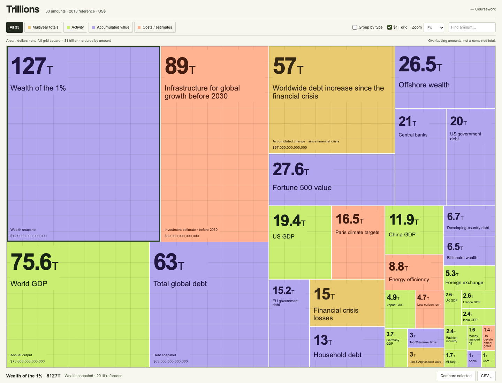

# Week 7 — Trillion Atlas

A React + D3 recreation of David McCandless’s proportional money graphic. Explore all 33 amounts in the original graphic through a full-width mosaic with zoom, grouping and a trillion-dollar grid.

[Hosted page](https://sd7777777.github.io/data-visualization-student-starter/week-7.html) · [Inspiration](https://informationisbeautiful.net/visualizations/trillions-what-is-a-trillion-dollars/) · [Original 2018 graphic](https://infobeautiful4.s3.amazonaws.com/2018/08/trillions-2x1276.png)

## Sources and interpretation

All 33 values are transcribed from the original graphic dated August 16, 2018, credited to David McCandless / Information is Beautiful. They are historical reference values, not current estimates. The image does not supply every observation date or definition; the selection notes identifies those gaps.

The four categories—activity, accumulated value, costs/estimates and multiyear totals—are additions to this recreation. Amounts overlap and have different time bases, so the mosaic is not a set of shares of one total. There is no inflation adjustment or automatic annualization.

## Design and implementation

- The mosaic preserves the reference’s proportional-area idea. A balanced binary partition gives every value the same area-per-dollar scale within a view. Filtering refits the layout.
- A $1T grid uses the same area scale across all blocks. Edge cells are partial units; this is a scale reference, not invented subcategories.
- Grouping by type preserves each block’s area. Zoom enlarges both dimensions equally, up to 300%; search highlights matches without rearranging the layout.
- Full labels, time bases and dollar expansions appear as space permits. Small labels adapt to available space; selection exposes the full source context.
- [D3 linear scales](https://d3js.org/d3-scale/linear) produce zero-based comparison bars in a collapsed panel.
- Selecting a block shows its value, source context and a comparison action. A ratio compares numerical size, not equivalent resources.
- Comparison links preserve the selected pair. CSV downloads retain dates and source notes.
- Native controls support keyboard use; layouts adapt to mobile screens and reduced motion.

`TrillionAtlas.tsx` contains the interface; `data.ts` holds the values and layout functions; `trillion-atlas.css` contains scoped styles. `app/week-7/page.tsx` provides the static route. No reference images or proprietary code are bundled.

## Validation

```sh
node scripts/check_trillion_atlas.mjs
pnpm exec tsc --noEmit --incremental false
pnpm exec oxlint src/assignments/week-07 app/week-7 src/assignments/index.ts
pnpm build
```

`scripts/check_trillion_atlas_browser.mjs` verifies 33 blocks, chart prominence, grouped-area invariance, unit grid, search, zoom/scroll, filters, keyboard selection, source details, comparisons, CSV export, shared links and 320/390/768/1440px layouts. Configure `BASE_URL`, `PLAYWRIGHT_MODULE`, `CHROME_PATH` and `SCREENSHOT_DIR` as needed. `scripts/prepare_github_pages.py` prepares both asset and preload paths for GitHub Pages.


